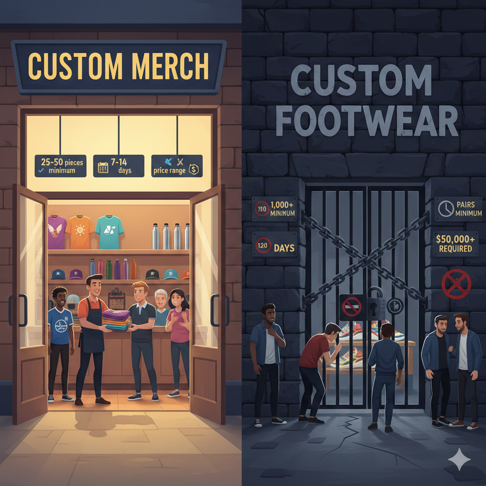

# SNEACA
## Custom Footwear That Tells Your Story

**"Wear Your Colors. Wear Your Soul."**

*Presented by: Udbhav Kansal, Founder*

---

## Slide 1: Our Team & Unfair Advantage

### Founder Background
- Identified massive gap in custom merchandise market
- Family connection to world-class manufacturing
- Deep understanding of B2B footwear needs

### Our Unfair Advantage

**Direct access to one of India's largest shoe manufacturing facilities**
- Family ownership ensures guaranteed capacity & priority production
- Built-in trust, reliability, and cost advantages

**Why We're Positioned to Win:** This isn't another startup trying to build supplier relationships — we OWN the factory access that competitors would spend years trying to secure.

---

## Slide 2: What is Sneaca?

### The Reality
Custom merchandise is everywhere — t-shirts, hats, water bottles — all available in small batches of 25-50 units with 7-14 day turnaround.

### The Problem
**But when you want custom shoes?** You hit a wall. Traditional manufacturers demand 1,000+ pairs, 120+ day lead times, and massive upfront costs.

For communities, corporations, and creators who want to tell their story through custom footwear, **it's essentially impossible.**

### Sneaca Solves This
We're a turnkey, design-to-door custom footwear service. Order just **40-50 pairs of custom sneakers** or **50 pairs of flip-flops**, delivered in **45 days**, with full design customization.

### What Makes Us Different
My family owns one of the largest shoe manufacturing facilities in India. We have **guaranteed factory access**, **cost advantages**, and **production expertise** that competitors simply cannot match.

---

## Slide 3: The Problem

Custom merchandise is ubiquitous — except for footwear.

### Comparison:
- ✓ **Custom T-Shirts:** 25-50 MOQ • 7-14 days
- ✓ **Custom Hats:** 25-50 MOQ • 7-14 days
- ✓ **Custom Water Bottles:** 25-50 MOQ • 7-14 days
- ✗ **Custom Shoes:** 1,000+ MOQ • 120+ days • $50K+ investment

### Who's Affected:
- Sports Teams
- Tech Companies
- Cultural Communities
- Hotels & Resorts
- Universities
- Influencers

These organizations have **passion, identity, and stories to tell** — but no accessible way to express it through custom footwear at reasonable volumes.

---

## Slide 4: Our Target Customers

### 1. Communities & Associations
- **Description:** Tech communities, sports leagues, cultural associations
- **Use Case:** Limited-edition team shoes, cultural celebration footwear
- **Volume:** 50-250 pairs per order

### 2. Corporations & Hospitality
- **Description:** Startups, tech companies, hotels, resorts, spas, restaurants
- **Use Case:** Employee gifting, corporate events, guest experiences
- **Volume:** 100-500 pairs per order

### 3. FIFA 2026 Beachhead
- **Description:** Vancouver's soccer-loving communities (Brazil, Ukraine, Italy, Iran, Portugal)
- **Use Case:** Community pride capsules, event merchandise, tourism products
- **Volume:** 200-500 pairs per capsule

### Why These Segments?
- Clear identity and storytelling needs
- Budget to invest in quality merchandise
- Events and milestones requiring custom products
- Proven demand for custom branded items

---

## Slide 5: How Problem is Solved Today

None of these alternatives are good:

### Option 1: Traditional Manufacturers
- **MOQ:** 1,000-5,000 pairs
- **Timeline:** 120-180 days
- **Cost:** $30K-$100K+ upfront
- ❌ Too expensive, too slow, too risky for most organizations

### Option 2: Print-on-Demand Services
- **Examples:** Printful, Printify
- **Offering:** Limited slip-ons with printed insoles/uppers
- ❌ Poor quality, limited customization, no true "custom" manufacturing

### Option 3: Promotional Product Distributors
- **Examples:** 4imprint, Vistaprint
- **Offering:** Pre-made shoes with simple logo embroidery
- ❌ No design freedom, generic products

### Option 4: Do Nothing
- Order custom t-shirts, hats, bags instead
- ❌ Misses emotional impact and premium positioning of custom footwear

**For small-batch custom footwear (50-500 pairs), there is no good solution today.** This is the gap Sneaca fills.

---

## Slide 6: Our Solution — What We Built

### What Was Impossible Is Now Possible

**We created the first turnkey system that makes custom footwear accessible at small volumes — transforming what was once a $50,000, 120-day barrier into a simple 50-pair, 45-day reality.**

---

### Who Benefits & How

#### 1. **Communities & Associations** (Tech groups, running clubs, cultural organizations)
- **Get:** Matching custom shoes that create visual unity and belonging
- **Benefit:** Turn 50-200 members into a walking billboard of community pride
- **Example:** Brazilian community in Vancouver ordering 500 pairs for FIFA 2026

#### 2. **Corporations & Startups** (50-500 employees)
- **Get:** Unique employee perks and conference swag that stands out
- **Benefit:** "Not just another t-shirt" — memorable brand moments that employees actually wear
- **Example:** Tech company ordering 100 pairs for company-wide shoe drop

#### 3. **Hospitality & Tourism** (Hotels, restaurants, spas, attractions)
- **Get:** Branded guest amenities and staff uniforms that elevate experience
- **Benefit:** Premium positioning and additional retail revenue stream
- **Example:** 4-star hotel offering custom slides in every guest room

#### 4. **Universities & Athletics** (Bookstores, teams, clubs)
- **Get:** Spirit wear and team merchandise beyond standard apparel
- **Benefit:** Higher-margin products that students and alumni actually want
- **Example:** UBC Bookstore stocking faculty-specific custom sneakers

#### 5. **Events & Conferences** (1,000-10,000 attendees)
- **Get:** VIP gifts and sponsor activations that create social media moments
- **Benefit:** Higher perceived value than standard swag — attendees post "sneaker selfies"
- **Example:** Tech conference gifting 200 pairs to speakers and VIPs

#### 6. **Digital Influencers & Creators** (50k-1M followers)
- **Get:** Their own footwear line without $50K+ investment
- **Benefit:** High-margin product (sell at $80-150, cost $40-60) that builds brand credibility
- **Example:** Fitness influencer launching limited-edition recovery slides (200 pairs)

---

### How We Make It Possible: Our Unfair Advantage

**This isn't a business model innovation — it's a manufacturing capability breakthrough.**

#### The "Impossible" Challenge:
Custom footwear in small batches requires:
- Flexible production lines willing to run <1,000 pairs (most factories refuse)
- Technical expertise in shoe construction and quality control
- Speed without sacrificing quality
- Predictable costs at low volumes

**Most startups spend years trying to find a factory partner. We already own the access.**

#### Our Moat (Cannot Be Replicated):

**1. Exclusive Manufacturing Access**
- My father owns one of India's largest shoe manufacturing facilities
- I have **exclusive North American rights** to this world-class, just-in-time production
- **21 years of built trust** — guaranteed capacity, priority production, cost advantages
- Access to the **world's most advanced automated flip-flop production line**

**2. Deep Domain Expertise**
- 3 years hands-on footwear manufacturing experience
- Trained by **Arc'teryx founders** (world-class footwear makers)
- Facilitated Shoes × MistyWest collaboration
- AI implementation consulting for manufacturing
- Understanding of both design innovation AND production operations

**3. Small-Batch SOPs Built Over Years**
- Purpose-built processes for 40-2,000 pair runs
- Most factories optimize for 5,000+ pairs
- Our sweet spot is where competitors have a gap

**4. Speed + Quality Combination**
- **45-day delivery** with ≥98.5% First Pass Yield
- Competitors: fast OR quality, not both
- **Proven:** Red Thread Club pilot delivered in 7 days with 70% gross margin

---

### What Customers Get: The Complete Service

#### Design-to-Door in 45 Days:

**Step 1: Design Proof (72 hours)**
- AI-powered mockups and realistic 3D renders
- 2-3 design concepts with 2 revision rounds
- Production-ready tech pack

**Step 2: Pre-Production Sample (10 days)**
- Physical sample shoe created and shipped
- Client tests fit, quality, materials before committing to production
- Zero risk — see exactly what you'll get

**Step 3: Manufacturing & Delivery (30-45 days)**
- Bulk production at family facility
- ≥98.5% First Pass Yield quality assurance
- Air freight to Canada/US
- White-glove delivery

**Total: 45 days from concept to wearing custom shoes**

---

### Product Range

#### Phase 1 (Now):
- Low-top sneakers (40-pair minimum)
- Slip-ons (40-pair minimum)
- Court-style sneakers (40-pair minimum)
- Slides & flip-flops (50-pair minimum)

#### Customization Power:
- Full-panel custom printing (any design, unlimited colors)
- Custom patches, overlays, and 3D elements
- Embroidery (logos and text)
- Laser-printed individual names/numbers
- Custom lace colors and eyelets
- Branded packaging boxes

**No design limitations. No generic templates. True custom manufacturing.**

---

### Intellectual Property & Patents

**Patent Status:** No patents or patent applications

**Why:** This is not a technology or product invention — it's an **access-based business model** powered by exclusive manufacturing relationships that cannot be patented.

**Our defensibility comes from:**
1. **Exclusive manufacturing rights** (contractual, not patent-based)
2. **21-year family relationship** (trust-based, not replicable)
3. **Domain expertise** (experience-based, not protectable)
4. **Just-in-time production capability** (operational advantage)

**UBC IP:** No UBC intellectual property involved — all manufacturing relationships and expertise pre-date any UBC affiliation.

---

### Proof: Already Validated

**Red Thread Club Pilot (Our First Customer):**
- **$600 revenue** in custom flip-flops
- **70% gross margin** (exceptional unit economics)
- **7-day delivery** (demolished our 45-day standard)
- **100% customer satisfaction** — validated design, quality, and service

**This isn't theoretical. We've done it. We can scale it.**

---

### Why This Matters: The Transformation

**Before Sneaca:**
- Want custom shoes for your 100-person community? Impossible.
- Want to launch a footwear line with 200 pairs? Not happening.
- Want hotel guest amenities that aren't generic? Too expensive.

**With Sneaca:**
- **50 pairs minimum** — accessible to small groups
- **45 days delivery** — fast enough for events and launches
- **$60/pair sneakers, $30/pair flip-flops** — premium but affordable
- **Turnkey service** — we handle design, manufacturing, quality, logistics

**We didn't just improve custom footwear. We made it possible.**

---

### Visual: Customer Journey Transformation

**The gap we're closing:** Making custom footwear as accessible as custom t-shirts.

---

## Key Takeaway

**Sneaca isn't selling shoes — we're selling solidarity, identity, and belonging.**

When a community wears matching custom shoes:
- They feel connected to something bigger
- They create memorable shared experiences
- They show pride in their group
- They build lasting bonds

**And now, for the first time, they actually can.**

---

## Slide 7: Market Validation - Proof of Concept

**We're not just an idea — we've already delivered.**

### Key Metrics:
- **$600** Revenue Generated
- **7 Days** Order to Delivery
- **70%** Gross Margin

### Red Thread Club Pilot Program

#### What We Delivered:
- **Product:** Custom flip-flops with full brand customization
- **Customer Type:** Community organization (target segment)
- **Timeline:** 7 days from order to delivery
- **Economics:** 70% gross margin ($420 profit on $600 order)
- **Quality:** Met/exceeded customer expectations

#### What This Validates:
- ✓ Market demand for small-batch custom footwear
- ✓ **Exceptional speed:** 7 days vs. competitors' 60-180 days
- ✓ **Outstanding unit economics:** 70% margin vs. industry 40-50%
- ✓ Manufacturing capability and agility proven
- ✓ End-to-end process from design to delivery
- ✓ Strong pricing power and customer willingness to pay

### Why This Matters:

**Speed is a Superpower**
7-day delivery demolishes competitor timelines (60-180 days) — our manufacturing advantage in action

**Exceptional Unit Economics**
70% gross margin proves strong pricing power and sustainability — far exceeding industry standard of 40-50%

**De-Risked & Repeatable**
Proven every aspect with real customer — this blueprint can scale 10x, 50x, 100x

**Market Gap Confirmed**
Customer chose us because no alternative exists — we're the only viable solution in this space

### Path to Scale:
- **Red Thread Club pilot:** $600 revenue, $420 profit (70% margin)
- **10 similar orders:** $6,000 revenue, $4,200 profit
- **50 similar orders:** $30,000 revenue, $21,000 profit
- **100 orders + larger deals:** **$100K+ revenue, $70K+ profit in 90 days**

With proven speed (7 days), exceptional margins (70%), and validated demand, we're ready to scale.

---

## Slide 8: Why Now?

Three converging forces make this the perfect moment:

### 1. FIFA World Cup 2026 in Vancouver
- Vancouver hosts **7 matches** in June-July 2026
- Expected **300,000+ international visitors** to BC Place area
- Massive wave of community pride, tourism, and merchandise demand

**Opportunity:** Launch with 5 community pride capsules
**Positioning:** "Wear Your Colors"

### 2. Manufacturing Access at Inflection Point
- Family factory now has capacity and systems for small-batch production
- Investment in cutting-edge equipment completed
- SOPs developed specifically for 50-2,000 pair runs

**Timing:** This capability didn't exist 2 years ago — it exists now

### 3. Custom Merchandise Market Maturity
- Organizations are sophisticated buyers of custom merch
- Proven demand: custom apparel market grew from $3.64B (2019) to $5.1B (2024)
- Footwear is the LAST category to be democratized for small batches

**FIFA 2026 gives us a defined moment** to prove our model with high visibility, passionate communities, and concentrated demand. It's the perfect ignition point.

---

## Slide 9: Market Opportunity

### TAM: $5.1 Billion
- Global promotional products market (North America focus)
- Custom apparel and merchandise segment • Growing 7% annually

### SAM: $850 Million
- Organizations ordering 50-2,000 units of custom merchandise
- Footwear as premium merchandise category

### SOM: $15-20 Million (Year 1-3)
- Vancouver + Canadian markets initially

### Primary Markets (Year 1):

**FIFA Communities (Vancouver)**
5 capsules × $40-60K = $200-300K

**Corporations & Startups**
30-50 companies × $15-25K = $450-750K

**Hospitality & Tourism**
20-30 venues × $10-20K = $200-400K

### Unit Economics:
- Average order value: $2,500-$3,500
- Target: 150-200 orders in Year 1
- Revenue: $375K-$700K

### Why This Market?
- Underserved (no viable solution exists)
- Proven demand (custom apparel validates willingness to pay)
- Premium positioning (2-3x higher prices than apparel)
- High retention (customers order 2-3× per year)

---

## Slide 10: Competitive Landscape

### Direct Competitors (Custom Footwear Manufacturing)

**Traditional Manufacturers (Alibaba, IndiaMART)**
- MOQ: 1,000-5,000 pairs
- Lead Time: 120-180 days
- Pricing: $15-25/pair
- **Our Advantage:** ✓ 40-50 pair MOQ • ✓ 45-day delivery • ✓ Relationship-based reliability

**Promotional Distributors (4imprint, Vistaprint)**
- MOQ: 100-500 pairs
- Lead Time: 60-90 days
- Pricing: $40-80/pair
- **Our Advantage:** ✓ True custom manufacturing • ✓ Full design freedom • ✓ Higher quality

### Our Competitive Moat (Four Pillars):

**1. Privileged Factory Access**
Family ownership • Guaranteed capacity • Cannot be replicated

**2. Small-Batch Expertise**
Purpose-built SOPs for 50-2,000 pairs • 5+ years to build

**3. Integrated Tech Workflow**
72-hour design-to-tech-pack • AI visualization • PM tracking

**4. Predictable Quality & Speed**
95%+ on-time • 98.5%+ First Pass Yield • 45-day average

**Key Insight:** We compete on **2 out of 3** (Price/Service/Quality) and win on **Service + Quality**. Our pricing is competitive, but our speed and reliability are unmatched in the small-batch segment.

---

## Slide 11: Business Model

**B2B Wholesale Manufacturing**

### Custom Sneakers (Wholesale, CAD)

| Quantity | Price per Pair | Typical Order Value |
|----------|----------------|---------------------|
| 50-99 pairs | $60 | $3,000-$5,940 |
| 100-249 pairs | $55 | $5,500-$13,695 |
| 250-499 pairs | $50 | $12,500-$24,950 |
| 500-999 pairs | $45 | $22,500-$44,955 |
| 1,000+ pairs | $40 | $40,000+ |

### Custom Flip-Flops/Slides (Wholesale, CAD)

| Quantity | Price per Pair | Typical Order Value |
|----------|----------------|---------------------|
| 50-99 pairs | $30 | $1,500-$2,970 |
| 100-249 pairs | $28 | $2,800-$6,972 |
| 250-500 pairs | $26 | $6,500-$13,000 |
| 1,000+ pairs | $22 | $22,000+ |

### Unit Economics Example (100-pair shoe order at $55/pair):

**Revenue:** $5,500 (100 pairs × $55)

**Total Costs:** $3,600
- Manufacturing: $3,000
- Packaging & shipping: $250
- Design & samples: $150
- Operations: $200

**Gross Margin:** $1,900 (34.5%)
**Target: 48-52%**

### Path to $100K (First 90 Days):
- **38-40 total orders**
- Shoes: ~26 orders (~$60,720)
- Flip-flops: ~12-14 orders (~$48,000)
- **Total: $108,720-$116,720**

---

## Slide 12: The Ask - Join UBC Venture Founder

**We're not asking for money. We're asking for what will make Sneaca unstoppable.**

Sneaca has the product, the market validation, and an unfair manufacturing advantage. What we need now are the **connections, mentorship, resources, and business strategy** that will transform us from a promising startup into a category-defining business.

### What We're Seeking from Venture Founder:

**1. World-Class Mentorship**
- Access to **250+ mentors** — experienced entrepreneurs, industry experts, and UBC alumni who've navigated the journey from startup to scale
- **Why this matters:** Avoid costly mistakes and compress our learning curve from years to months

**2. Strategic Network & Connections**
- **800 alumni ventures** that raised **$221M+ in funding**
- Direct connections to Vancouver's corporate, hospitality, sports, and investor communities
- **Why this matters:** Access to decision-makers who can become our first major customers and partners

**3. Structured Business Strategy**
- **16-week intensive program** covering validation, business modeling, financial planning, team building, and go-to-market strategy
- **Why this matters:** A proven roadmap used by 50 cohorts to build sustainable, scalable businesses

**4. Resources & Ecosystem Access**
- Infrastructure, tools, and support from UBC's innovation ecosystem

- **Why this matters:** Leverage proven systems and resources that have created billion-dollar companies

### Why Venture Founder, Why Now:

**Navigate FIFA 2026 Launch**
Our beachhead strategy requires precision execution — mentorship will help us maximize this once-in-a-generation opportunity

**Validate & Refine Business Model**
Stress-test our pricing, operations, and growth strategy with mentors who've scaled similar businesses

**Accelerate Customer Acquisition**
Network connections can unlock our first 10-20 corporate and hospitality customers faster than cold outreach

**Build for Scale**
Develop systems, processes, and partnerships to grow from $100K to millions in annual revenue

### What We Bring:
- **Validated Demand:** $600 pilot with Red Thread Club proves market readiness
- **Unfair Advantage:** Family-owned manufacturing facility ensures execution capability
- **Clear Vision:** FIFA 2026 provides defined launch timeline and high-visibility opportunity
- **Commitment:** Ready to work, learn, and build the right foundation for long-term success

We're not here to raise money. We're here to **build the right foundation** — with mentorship, connections, and strategy that will ensure Sneaca doesn't just launch, but thrives.

---

## Closing

**I'm ready to do the work. I'm ready to learn. I'm ready to build.**

**Let's make Sneaca the next Venture Founder success story.**

---

*End of Pitch Deck*
